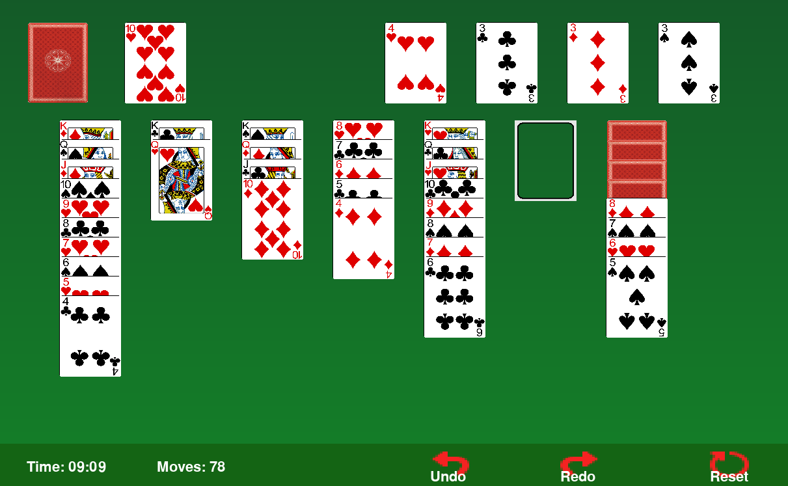

# 🎴 Solitaire Classic


A classic **Klondike Solitaire** game built with **Python** and **Pygame**, featuring drag-and-drop, undo/redo, stock/waste piles, and an interactive GUI.

---
## 🖥️ Demo


---
## 🔹 Features

- Classic **Klondike Solitaire** rules  
- Drag-and-drop cards between tableau, waste, and foundation  
- **Undo / Redo** moves  
- **Reset** game functionality  
- Time and move tracking  
- Gradient background with card animations  
- Victory detection with overlay message  
---
## 📂 File Structure
```text
solitaire/
├─ main.py                 # Entry point
├─ assets/                 # Images (cards, icons)
│  ├─ 1_of_clubs.png ...  # All 52 cards + icons
├─ files/
│  ├─ buttons.py           # Button classes (Undo, Redo, Reset)
│  ├─ cards.py             # Card class and image handling
│  ├─ constants.py         # Screen size, colors, constants
│  ├─ piles.py             # Pile classes (Tableau, Stock, Waste, Foundation)
│  ├─ game.py              # Main SolitaireGame class & logic
│  ├─ utils.py             # Helper functions (image loader)
```
---
## ⚡ Installation

1. Clone the repository:

    ```bash
    git clone https://github.com/javairia772/solitaire-classic.git
    cd solitaire-classic
    ```


2. Create a virtual environment (recommended):
    ```bash
    python -m venv venv
    source venv/bin/activate   # Linux/Mac
    venv\Scripts\activate      # Windows
    ```

3. Install dependencies:
    ```bash
    pip install pygame
    ```
---
## ▶️ How to Run

From the project root directory:
```bash
python -m solitaire.main
```

Make sure all relative imports work. Running without *-m* may cause import errors.

---

## 📝 Gameplay Instructions

- Click and drag cards to move between tableau, waste, and foundation piles.
- Stock pile: Click to draw a card into the waste pile.
- Undo / Redo: Use the buttons at the bottom to revert or redo moves.
- Reset: Start a new game.
- Game ends when all cards are placed into the foundation piles.

---
## 🛠️ Technical Details

- [Python](https://www.python.org/) 3.10+
- Pygame for GUI and events
- Modular design:
    - cards.py → Card management
    - piles.py → All piles including stock, waste, foundation
    - buttons.py → Undo, Redo, Reset
    - game.py → Core Solitaire game logic and main loop
    - utils.py → Helper functions for image loading
- Undo/Redo implemented via state stacks storing piles, foundation, stock, and waste.

---

## 🎨 Assets

- All card images are stored in **/assets**
- Reset, undo, redo icons are included
---
## 💡 Future Improvements

- Add sound effects for moves and winning
- Add animated card flips
- Mobile-friendly version with touch support
- Custom themes and card backs
---
## 📄 License

MIT

**Free Software, Hell Yeah!**

---
